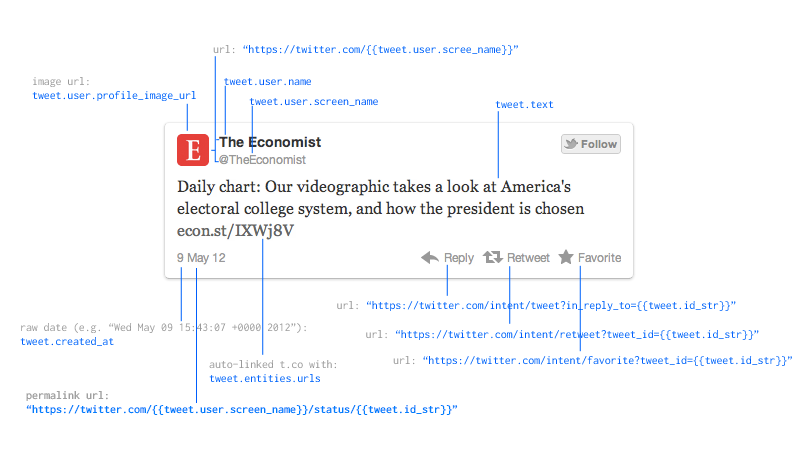

# Displaying Status Entities

Special care must be taken when displaying status entities.

To access data from the API, a customer must have accepted Mass Relevance's
API usage agreement. This includes agreeing to comply with [Twitter Display
Guidelines](https://dev.twitter.com/terms/display-guidelines) when
displaying Twitter statuses. This document is supposed to supplement
Twitter's guidelines and not replace or supersede it.

*Twitter Display Guidelines* 
https://dev.twitter.com/terms/display-guidelines

## Anatomy of a Tweet

